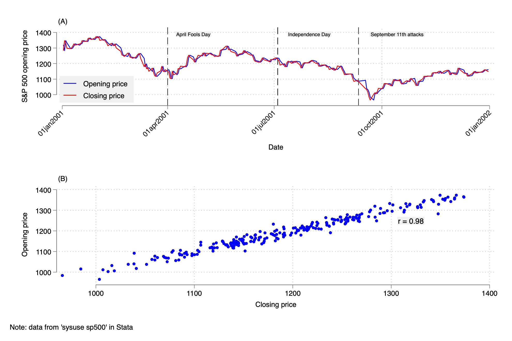

class: center, middle, inverse
background-image: url("asu-logo.png")
background-position: 95% 92%
background-size: 8%


# SIMD Workshop: Stata Graphics

<br>

[Seth Watts](https://sethwatts.quarto.pub/sbw/)  
*School of Criminology and Criminal Justice*  
*Arizona State University*

<br>
<br>
.white[September 20, 2024]

---
class: top

<div class="footer">
  Arizona State University
</div>

# Why should you care?

--

- The more you can do in one software the better!

--

    - **Efficient workflows** are everything
    
--

- Point and click graphics are so 2008 (see Black Eyed Peas, 2009)

--

- Repeatability and reproducibility

--

    - Isn’t it so fun having to redo a figure you created time and time again, starting from the beginning each time?
    
--

- Being able to present data/findings through effective visualizations is a powerful skill

---
class: top
background-image: url(repeat-reproduce.jpg)
background-position: 95% 40%
background-size: 50%

<div class="footer">
  Arizona State University
</div>

# Importance of using code 

--

- Repeatability for yourself

--

- Reproducibility for others

--

- Efficiency

--

- Highly flexible

--

- Skill development

---

<div class="footer">
  Arizona State University
</div>

# The power of data visualization

- Enhanced interpretation

  - Tables can sometimes be hard to interpret

- Engagement 

  - Your audience is likely going to appreciate an effective visual instead of a table – especially policy-makers and practitioners!

---

## Don't you want to make cool figures like this?

```{r, echo=FALSE, fig.align='center', out.height = "100%", out.width = "80%"}

```


---
<div class="footer">
  Arizona State University
</div>

# Let's walk through some code

- Visit my Github repository: https://github.com/sBwatts/figure-making-stata

  - See “figure-making-stata.do”

  - Note: I consider this a work in progress and will update/add to it

- *Shameless plug* – If you are interested in how to make wonderful tables in Stata see my “table-making-stata” repository on Github for some tips: https://github.com/sBwatts/table-making-stata 

---

# References

Black Eyed Peas. (2009). Boom boom pow [Song]. On The E.N.D. (Energy Never Dies). Interscope Records.
